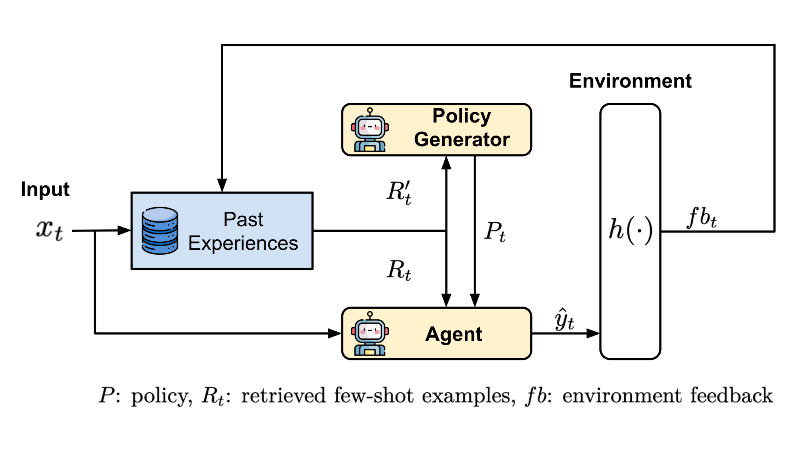

# DRPG:Dynamic Retrieval-based Policy Generation

論文 **《Smarter by the Moment: Environment-Driven Dynamic Policies for Continual LLM Improvement》**(COLM 2026)的程式碼。

[論文 (arXiv:2609.16800)](https://arxiv.org/abs/2609.16800) ·  [English README](README.md)



DRPG 讓 LLM agent 在處理一連串任務的過程中持續變強,而且不動到模型權重。每一步,agent 手上有兩樣從自己歷史裡拿出來的東西:檢索到的、過去答對的範例,還有一份 **policy**,也就是另一個模型讀過它過去答對與答錯的案例之後,整理出來的幾條可執行規則。環境回傳答案對或錯,這個回饋寫進記憶體,下一份 policy 就是從更完整的歷史寫出來的。

和先前的 memory-based 方法差在「重複使用什麼」。Self-StreamICL 重複使用的是*案例*;DRPG 還重複使用*策略*,所以一直重犯的錯誤有機會被寫成一條規則躲掉,而不是每次都只是再檢索一次類似題目。

```
t:  收到 x_t
    R_t   = retrieve(x_t, 答對的案例)                      # 給 agent 的 few-shot
    R'_t  = retrieve(x_t, 答對) ∪ retrieve(x_t, 答錯)      # 對比式,各 k/2 筆
    P_t   = policy_generator(R'_t)                        # 最多五條規則
    ŷ_t   = agent(x_t, R_t, P_t)
    fb_t  = environment(x_t, ŷ_t)                         # 1 或 0
    memory.add(x_t, ŷ_t, fb_t)
```

在 6 個 benchmark、7 個 LLM 上,DRPG 在多數的「模型 × 資料集」組合勝過 Zero-shot、Self-Refine 與 Self-StreamICL,代價是每題多一次 LLM 呼叫。

---

## 專案結構

| 路徑 | 內容 |
| --- | --- |
| `stream_bench/agents/policy.py` | **DRPG**(`agent_name: rag_policy`):檢索、產生 policy、作答、更新記憶體 |
| `stream_bench/agents/policy_rag.py` | DRPG 變體,記憶體會一併存下寫入當下的 policy |
| `stream_bench/agents/dynamic_cheatsheet.py` | Dynamic Cheatsheet,當作「沒有環境回饋」的對照 |
| `stream_bench/agents/fewshot_rag.py` | Self-StreamICL 與 MemPrompt |
| `stream_bench/agents/iter_prompt.py` | Self-Refine |
| `stream_bench/agents/zeroshot.py` | Zero-shot |
| `stream_bench/agents/utils.py` | BGE + FAISS 的記憶體(`RAG`)與 backend 工廠(`get_llm`) |
| `stream_bench/benchmarks/` | 6 個串流環境與各自的評分方式 |
| `stream_bench/llms/` | 每家 LLM 供應商一支輕量 client |
| `stream_bench/pipelines/run_bench.py` | 評測主迴圈,所有實驗的進入點 |
| `configs/agent/`、`configs/bench/` | 方法與 benchmark 的 config(由 `scripts/gen_configs.py` 產生) |
| `docs/configuration.md` | 每個設定欄位的意義與影響 |
| `docs/reproduce.md` | 論文每張表對應哪組設定 |

本專案是 [StreamBench](https://github.com/stream-bench/stream-bench)(Apache-2.0)的精簡 fork,只保留論文用到的 6 個 benchmark 與方法。哪些程式碼來自哪裡,詳見 [`NOTICE`](NOTICE)。

---

## 安裝

需要 Python 3.10 以上。所有指令都用 [uv](https://docs.astral.sh/uv/);相依套件寫在 `pyproject.toml`,版本鎖在 `uv.lock`。

```bash
git clone https://github.com/tingwei161803/drpg.git
cd drpg
uv sync
```

DS-1000 是把模型產生的程式碼直接執行來評分,所以那些題目用到的函式庫必須裝在同一個環境。只有要跑 DS-1000 才需要加裝:

```bash
uv sync --extra ds1000
```

也因為是真的執行程式碼,DS-1000 的分數對 NumPy、pandas 這類套件的版本很敏感,跨大版本會有幾題的參考輸出對不起來。

### 資料

DDXPlus、HotpotQA、DS-1000 會在第一次使用時自動從 Hugging Face 的 [`appier-ai-research/StreamBench`](https://huggingface.co/datasets/appier-ai-research/StreamBench) 下載,不用額外處理。

三個 text-to-SQL benchmark 還需要各自的 SQLite 資料庫,會放到 `./data`:

```bash
uv run download_text2sql_data.py
```

### API 金鑰

每個 backend 都從環境變數讀金鑰,config 檔裡不會出現任何金鑰。

```bash
cp .env.example .env
$EDITOR .env
source .env
```

論文的實驗跑在 Google AI Studio(`series: gemini_dev`,需要 `GOOGLE_API_KEY`)與 NVIDIA NIM(`series: nvidia`,需要 `NVIDIA_API_KEY`),兩邊的免費額度就夠用。其他供應商列在 `.env.example`。

### 確認環境沒問題

正式花 token 之前,先跑 oracle agent:它直接用正確答案作答,分數應該接近 100%,可以確認資料集、回饋迴圈與評分都接好了。這支不需要任何 API 金鑰。

```bash
uv run python -m stream_bench.pipelines.run_bench \
    --agent_cfg configs/agent/gt.yml \
    --bench_cfg configs/bench/ddxplus.yml
```

也可以完全不連網,檢查所有 agent config 是否都能正常建立:

```bash
uv run scripts/validate_configs.py
```

---

## 跑 DRPG

```bash
uv run python -m stream_bench.pipelines.run_bench \
    --agent_cfg configs/agent/drpg/gemini-2.0-flash.yml \
    --bench_cfg configs/bench/spider.yml
```

這會把整個 Spider test split 以串流方式跑完,最後印出分數。加上 `--use_wandb --entity "$WANDB_ENTITY"` 可以把每一步記到 Weights & Biases;供應商有流量限制時,用 `--slow_task`(每步等 5 秒)或 `--slow_slow_task`(等 10 秒)。

每一步的紀錄,包含送出的 prompt、原始輸出、token 數與當下產生的 policy,會寫進 `log/<benchmark>/test/<run name>.jsonl`,記憶體索引則存成同名的 `.jsonl.db`。

`scripts/run_drpg.sh` 可以把同一個方法跑過 6 個 benchmark。

### 方法對照

| 論文 | Config | `agent_name` |
| --- | --- | --- |
| DRPG (Ours) | `configs/agent/drpg/<model>.yml` | `rag_policy` |
| DRPG,換 policy generator(5.3 節) | `configs/agent/drpg-cross-generator/<agent>__policy-<generator>.yml` | `rag_policy` |
| Dynamic Cheatsheet,無環境回饋(附錄 F) | `configs/agent/dynamic_cheatsheet/<model>.yml` | `dynamic_cheatsheet` |
| Self-StreamICL(主要 baseline) | `configs/agent/self_stream_icl/<model>.yml` | `self_stream_icl` |
| Self-Refine | `configs/agent/self_refine/<model>.yml` | `self_refine` |
| Zero-shot | `configs/agent/zeroshot/<model>.yml` | `zeroshot` |

### Benchmark

| Config | 任務 | 評分 | 串流長度 |
| --- | --- | --- | --- |
| `configs/bench/spider.yml` | Text-to-SQL | 執行正確率 | 2,147 |
| `configs/bench/cosql.yml` | Text-to-SQL(對話式) | 執行正確率 | 1,007 |
| `configs/bench/bird.yml` | Text-to-SQL(較難) | 執行正確率 | 1,534 |
| `configs/bench/hotpotqa.yml` | 多跳問答,distractor 設定 | Exact match | 1,500 |
| `configs/bench/ddxplus.yml` | 醫療診斷,49 個選項 | 正確率 | 1,764 |
| `configs/bench/ds_1000.yml` | Python 資料科學 | pass@1 | 1,000 |

出題順序由 `seed: 42` 固定,所有方法看到的題目與順序完全一樣。

---

## 想改東西的時候

**換一個模型**:在 `scripts/gen_configs.py` 的 `MODELS` 加一筆,然後重新產生 config:

```bash
uv run scripts/gen_configs.py
uv run scripts/validate_configs.py   # 不連網,檢查所有 config
```

`series` 決定用 `stream_bench/llms/` 裡的哪支 client,`model_name` 則原樣送給供應商。

**換 policy generator**:把 `policy_llm` 指到另一個模型就好,不必和 `llm` 相同。論文 5.3 節顯示,用比較小的模型或不同家族的模型來產生 policy 一樣有效。

**寫自己的 agent**:繼承 `stream_bench/agents/base.py` 的 `Agent`,實作 `__init__`、`__call__`、`update`,再到 `stream_bench/agents/__init__.py` 註冊。

**接自己的 LLM**:繼承 `stream_bench/llms/base.py` 的 `LLM`,回傳 `(text, info)` 並填好 token 數,然後在 `stream_bench/agents/utils.py` 的 `get_llm` 加一個分支。

所有設定欄位(`policy_generator_mode`、`use_previous_policy`、`use_correct_fewshots`、`top_k` 等)都寫在 [`docs/configuration.md`](docs/configuration.md)。

---

## 重現論文結果

[`docs/reproduce.md`](docs/reproduce.md) 列出完整的實驗格線:哪個 config 對應哪張表、會看到什麼。有一點先講清楚:7 個模型全部是雲端 API,而 API 背後的 checkpoint 會更新也會下架,所以現在重跑能重現的是結果的*趨勢*,不是小數點後的數字。

---

## 引用

```bibtex
@inproceedings{chang2026drpg,
  title     = {Smarter by the Moment: Environment-Driven Dynamic Policies for
               Continual {LLM} Improvement},
  author    = {Chang, Ting-Wei and Chen, Po-Chun and Huang, Hen-Hsen and Chen, Hsin-Hsi},
  booktitle = {Conference on Language Modeling (COLM)},
  year      = {2026}
}
```

有用到這裡的 benchmark 環境的話,也請一併引用 StreamBench:

```bibtex
@article{wu2024streambench,
  title   = {StreamBench: Towards Benchmarking Continuous Improvement of Language Agents},
  author  = {Wu, Cheng-Kuang and Tam, Zhi Rui and Lin, Chieh-Yen and Chen, Yun-Nung and Lee, Hung-yi},
  journal = {Advances in Neural Information Processing Systems},
  volume  = {37},
  pages   = {107039--107063},
  year    = {2024}
}
```

## 授權

Apache License 2.0,見 [`LICENSE`](LICENSE) 與 [`NOTICE`](NOTICE)。各 benchmark 的資料集仍適用原本的授權條款。
